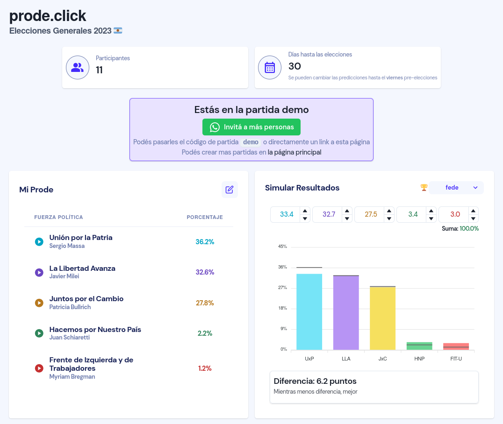

# [prode.click](https://prode.click/)

Predecí las elecciones argentinas!

---

Con este prode podés armar una partida fácil de entender y dejar de preocuparte por tantas cuentas manuales cuando no sabes quién tiene más razón en el asado. Armás una partida, le compartís el link al resto, y todos anotan cuanto piensan que cada candidato va a sacar. El que esta mas cerca por diferencia absoluta, gana.

- Cada persona puede crear y participar de todas las partidas que quiera, sin límite de participantes
- El día de las elecciones se actualizan los resultados en vivo y se va marcando quien esta más cerca de ganar
- Se pueden simular los resultados para ver como saldría cada uno sin esperar a que sea el día de las elecciones
- Agregar más elecciones es muy sencillo, y se puede extender el programa para que funcione en legislativas, PASO, ballotages, gobernadores, o cualquier tipo de elecciones
